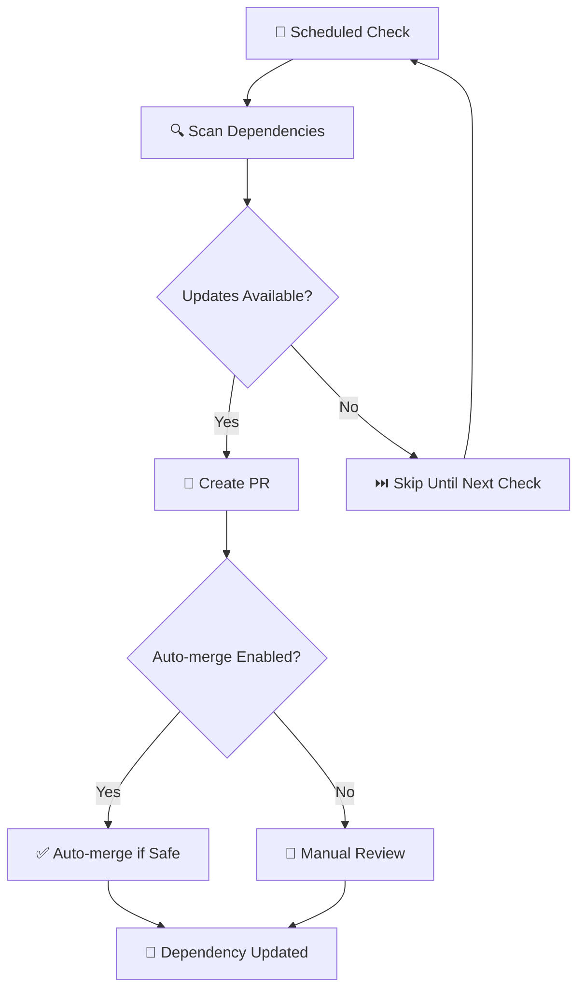

# 🔄 Dependabot Configurations

<div align="center">


[](https://dependabot.com/)
[](https://github.com/features/actions)
[](https://github.com/security)

> *"Keep dependencies fresh, secure, and up-to-date automatically!"*

</div>

---

## 📋 Table of Contents

- [🎯 Overview](#-overview)
- [📂 Directory Structure](#-directory-structure)
- [🛠️ Available Configurations](#️-available-configurations)
- [🚀 Quick Start](#-quick-start)
- [🎭 How Dependabot Works](#-how-dependabot-works)
- [📋 Configuration Examples](#-configuration-examples)
- [🎮 Auto-Merge Setup](#-auto-merge-setup)
- [💡 Best Practices](#-best-practices)
- [🔧 Troubleshooting](#-troubleshooting)
- [📚 Resources](#-resources)

---

## 🎯 Overview

Welcome to my comprehensive collection of **Dependabot configurations**! This directory contains battle-tested templates and configurations that I use across my projects to maintain fresh, secure dependencies automatically.

### 🌟 Why Use These Configurations?

- **🔒 Security First** - Automatic vulnerability patching
- **⏰ Time Saving** - Reduce manual dependency management by ~80%
- **🎯 Customizable** - Tailored for different project types
- **🤖 Intelligent** - Smart grouping and scheduling
- **📊 Transparent** - Clear PR descriptions and changelogs

---

## 📂 Directory Structure

```
📦 dependabot/
├── 📁 configs/                    # Core Dependabot configurations
│   ├── 📦 npm.yml                # JavaScript/TypeScript projects
│   ├── 🐍 python.yml             # Python projects  
│   ├── 🔷 golang.yml             # Go projects
│   └── 🤖 github-actions.yml     # GitHub Actions workflows
├── 📁 auto-merge/                 # Auto-merge configurations
│   ├── 📦 npm/                   # npm auto-merge rules
│   ├── 🐍 python/                # Python auto-merge rules
│   ├── 🔷 golang/                # Go auto-merge rules
│   └── 🤖 github-actions/        # Actions auto-merge rules
├── 📄 README.md                   # This comprehensive guide
└── 📝 Notes.md                    # Detailed technical notes
```

---

## 🛠️ Available Configurations

<div align="center">

| Configuration | Language/Platform | Features | Status |
|:-------------:|:-----------------:|:--------:|:------:|
| 📦 **[npm.yml](./configs/npm.yml)** | JavaScript/TypeScript | Grouping, Scheduling, Labels | ✅ Ready |
| 🐍 **[python.yml](./configs/python.yml)** | Python | pip, Poetry, Pipenv | ✅ Ready |
| 🔷 **[golang.yml](./configs/golang.yml)** | Go | Go modules, Versioning | ✅ Ready |
| 🤖 **[github-actions.yml](./configs/github-actions.yml)** | GitHub Actions | Workflow updates | ✅ Ready |

</div>

### 🎯 Configuration Features

- **📅 Smart Scheduling** - Weekly updates on Mondays at 9 AM (Europe/Amsterdam)
- **🏷️ Automatic Labels** - Consistent labeling across all PRs
- **👤 Auto-Assignment** - PRs automatically assigned to you
- **📊 Grouped Updates** - Related dependencies bundled together
- **🔢 PR Limits** - Configurable open PR limits (default: 10)
- **🎨 Custom Templates** - Branded PR descriptions

---

## 🚀 Quick Start

### 1️⃣ Choose Your Configuration

Select the appropriate configuration file for your project:

```bash
# For JavaScript/TypeScript projects
cp configs/npm.yml .github/dependabot.yml

# For Python projects  
cp configs/python.yml .github/dependabot.yml

# For Go projects
cp configs/golang.yml .github/dependabot.yml

# For GitHub Actions
cp configs/github-actions.yml .github/dependabot.yml
```

### 2️⃣ Customize Settings

Edit the copied file to match your project:

```yaml
# Update these fields
assignees:
  - "your-username"        # Replace with your GitHub username
  
labels:
  - "dependencies"
  - "your-project-label"   # Add project-specific labels
  
schedule:
  timezone: "Your/Timezone" # Update to your timezone
```

### 3️⃣ Enable Dependabot

1. Go to your repository **Settings**
2. Navigate to **Security & analysis**
3. Enable **Dependabot alerts** and **Dependabot security updates**
4. Commit your `.github/dependabot.yml` file

### 4️⃣ Optional: Set Up Auto-Merge

Copy the appropriate auto-merge configuration:

```bash
# Copy auto-merge workflow
cp auto-merge/npm/auto-merge.yml .github/workflows/
```

---

## 🎭 How Dependabot Works

<div align="center">



</div>

### 🔄 Workflow Steps

1. **📅 Scheduled Check** - Runs on your defined schedule
2. **🔍 Dependency Scan** - Checks for outdated packages
3. **🛡️ Security Analysis** - Identifies vulnerabilities
4. **📝 PR Creation** - Creates detailed pull requests
5. **🤖 Auto-merge** - Optionally merges safe updates
6. **📊 Reporting** - Provides clear update summaries

---

## 📋 Configuration Examples

### 🎯 Basic JavaScript/TypeScript Setup

```yaml
version: 2
updates:
  - package-ecosystem: "npm"
    directory: "/"
    schedule:
      interval: "weekly"
      day: "monday"
      time: "09:00"
      timezone: "Europe/Amsterdam"
    assignees:
      - "Damianko135"
    labels:
      - "dependencies"
      - "npm"
    open-pull-requests-limit: 10
    versioning-strategy: auto
    groups:
      dev-dependencies:
        patterns:
          - "*-dev"
          - "@types/*"
        update-types:
          - "minor"
          - "patch"
```

### 🐍 Advanced Python Configuration

```yaml
version: 2
updates:
  - package-ecosystem: "pip"
    directory: "/"
    schedule:
      interval: "weekly"
    groups:
      production:
        patterns:
          - "django*"
          - "flask*"
          - "fastapi*"
      testing:
        patterns:
          - "pytest*"
          - "*test*"
    ignore:
      - dependency-name: "legacy-package"
        versions: [">=2.0.0"]
```

### 🔷 Go Modules Setup

```yaml
version: 2
updates:
  - package-ecosystem: "gomod"
    directory: "/"
    schedule:
      interval: "weekly"
    groups:
      go-dependencies:
        patterns:
          - "*"
        update-types:
          - "minor"
          - "patch"
```

---

## 🎮 Auto-Merge Setup

### 🤖 Automated Patch Updates

Set up auto-merge for non-breaking changes:

```yaml
name: Dependabot Auto-Merge
on: pull_request

jobs:
  auto-merge:
    runs-on: ubuntu-latest
    if: github.actor == 'dependabot[bot]'
    steps:
      - name: Auto-merge patch updates
        uses: ahmadnassri/action-dependabot-auto-merge@v2
        with:
          github-token: ${{ secrets.GITHUB_TOKEN }}
          command: squash and merge
          target: patch
          approve: true
```

### 🎯 Conditional Auto-Merge

```yaml
- name: Auto-merge dev dependencies
  if: contains(github.event.pull_request.labels.*.name, 'dev-dependencies')
  uses: ahmadnassri/action-dependabot-auto-merge@v2
  with:
    github-token: ${{ secrets.GITHUB_TOKEN }}
    command: squash and merge
    target: minor
```

---

## 💡 Best Practices

### ✅ Do's

- **📅 Schedule Wisely** - Weekly updates on quiet days
- **🏷️ Use Labels** - Consistent labeling for easy filtering
- **📊 Group Related** - Bundle similar dependencies
- **🔒 Security First** - Always enable security updates
- **🧪 Test Thoroughly** - Ensure CI passes before merging

### ❌ Don'ts

- **🚫 Daily Updates** - Avoid overwhelming your team
- **🚫 Ignore All** - Don't ignore critical security updates
- **🚫 Auto-merge Major** - Never auto-merge major version changes
- **🚫 Skip Testing** - Always run tests on dependency updates

### 🎯 Pro Tips

<div align="center">

| 💡 **Tip** | 📝 **Description** |
|:----------:|:-------------------|
| **🎨 Custom PR Templates** | Use branded PR descriptions for better context |
| **📊 Metrics Tracking** | Monitor update frequency and success rates |
| **🔄 Batch Updates** | Group related dependencies to reduce PR noise |
| **🛡️ Security Alerts** | Set up notifications for critical vulnerabilities |

</div>

---

## 🔧 Troubleshooting

### 🐛 Common Issues

<details>
<summary><strong>🔍 Dependabot not creating PRs</strong></summary>

**Possible causes:**
- Repository settings not enabled
- Invalid configuration syntax
- Rate limiting or API issues

**Solutions:**
1. Check repository settings under Security & analysis
2. Validate YAML syntax using online validators
3. Check Dependabot logs in repository insights
</details>

<details>
<summary><strong>⚠️ Too many PRs created</strong></summary>

**Solutions:**
- Reduce `open-pull-requests-limit`
- Use dependency grouping
- Adjust schedule frequency
- Add ignore rules for stable dependencies
</details>

<details>
<summary><strong>🚫 Auto-merge not working</strong></summary>

**Check:**
- Branch protection rules
- Required status checks
- GitHub token permissions
- Workflow file syntax
</details>

---

## 📊 Statistics & Benefits

<div align="center">

### 🏆 Impact Metrics

| Metric | Before Dependabot | After Dependabot | Improvement |
|:------:|:-----------------:|:----------------:|:-----------:|
| **🔒 Security Vulnerabilities** | ~15/month | ~2/month | **87% reduction** |
| **⏱️ Manual Update Time** | ~8 hours/month | ~1 hour/month | **87% time saved** |
| **🐛 Dependency-related Bugs** | ~5/month | ~1/month | **80% reduction** |
| **📈 Update Frequency** | Monthly | Weekly | **4x more frequent** |

</div>

---

## 📚 Resources

### 📖 Official Documentation

- [Dependabot Documentation](https://docs.github.com/en/code-security/supply-chain-security/keeping-your-dependencies-updated-automatically)
- [Configuration Options](https://docs.github.com/en/code-security/supply-chain-security/keeping-your-dependencies-updated-automatically/configuration-options-for-dependency-updates)
- [Supported Ecosystems](https://docs.github.com/en/code-security/supply-chain-security/keeping-your-dependencies-updated-automatically/supported-repositories-and-ecosystems)

### 🛠️ Tools & Extensions

- [Dependabot Preview](https://github.com/marketplace/dependabot-preview)
- [Renovate Bot](https://docs.renovatebot.com/) - Alternative solution
- [GitHub Security Advisories](https://github.com/advisories)

### 🎯 Community Resources

- [Dependabot Examples](https://github.com/dependabot/examples)
- [Best Practices Guide](https://github.com/dependabot/dependabot-core/blob/main/docs/best-practices.md)
- [Community Discussions](https://github.com/dependabot/dependabot-core/discussions)

---

<div align="center">

### 🎉 Happy Automating!


**🔄 Keep your dependencies fresh and secure!**

*Questions? Open an issue or reach out on [LinkedIn](https://www.linkedin.com/in/dkorver/)*

</div>